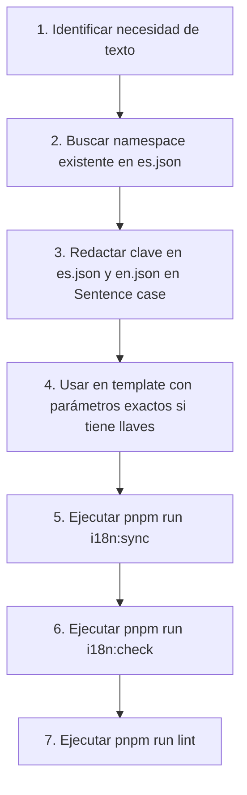

# Guía Canónica de Internacionalización (i18n) y Control de Calidad

Esta skill define las reglas obligatorias de diseño, redacción, sintaxis y verificación para cualquier cambio de texto en `sapcyti-spa`. Cualquier agente que agregue, modifique o use textos en la interfaz debe seguir esta guía sin excepción.

---

## 1. Principio Fundamental: Zero-Glitch i18n

1. **Cero textos hardcodeados**: Todo texto visible al usuario final (etiquetas, botones, mensajes, títulos, placeholders, aria-labels) DEBE provenir de los catálogos de traducción.
2. **Cero claves crudas en pantalla (`CLAVE.OBJETO`)**: Una clave literal en la interfaz indica que no existe en el catálogo o que tiene una errata en el template.
3. **Cero llaves sin interpolar (`{{param}}`)**: Un placeholder dinámico visible indica que el template no pasó el parámetro requerido o que los nombres de los identificadores no coinciden.

---

## 2. Reglas Estrictas de Capitalización (Sentence Case)

Todo texto en los archivos de traducción ([`src/assets/i18n/es.json`](src/assets/i18n/es.json) y [`src/assets/i18n/en.json`](src/assets/i18n/en.json)) debe seguir las siguientes reglas:

### A. Formato Obligatorio: *Sentence case*
- **Regla**: La primera letra de la frase, título, etiqueta o botón inicia con **mayúscula**. El resto de las palabras van en **minúscula**, salvo siglas o nombres propios.
- **Aplica tanto a Español como a Inglés**: Evita el *Title Case* anglosajón innecesario donde cada palabra lleva mayúscula.

| Tipo | ❌ Incorrecto | ✔️ Correcto |
|---|---|---|
| **Etiqueta KPI** | `"alumnos registrados"` / `"registered students"` | `"Alumnos registrados"` / `"Registered students"` |
| **Botón de acción** | `"iniciar proceso"` / `"Start Process"` | `"Iniciar proceso"` / `"Start process"` |
| **Estado o badge** | `"ya tiene planeación"` / `"already planned"` | `"Ya tiene planeación"` / `"Already planned"` |
| **Unidad de medida** | `"créditos"` / `"credits"` | `"Créditos"` / `"Credits"` |
| **Pestaña / Título** | `"Planeación Trimestral Del Posgrado"` | `"Planeación trimestral del posgrado"` |

### B. Siglas y Nombres Propios
- **Siglas institucionales**: Deben mantenerse en mayúsculas completas: `UEA`, `UAM`, `NEMP`, `PDF`, `CSV`, `ID`, `KPI`, `RBAC`.
  - Ejemplo: `"Catálogo de UEAs"`, `"Generar reporte en PDF"`.
- **Nombres propios**: Con mayúscula inicial (ej. *"Trimestre 26-Invierno"*).

### C. Excepciones Técnicas Permitidas (Whitelist)
- **Placeholders de correos electrónicos**: Deben mantenerse en minúsculas por convención técnica en `<input type="email">`:
  - `AUTH.FORGOT_PASSWORD.EMAIL_PLACEHOLDER`: `"usuario@correo.uam.mx"` / `"user@email.uam.mx"`
  - `AUTH.LOGIN.EMAIL_PLACEHOLDER`: `"alumno@correo.uam.mx"` / `"student@email.uam.mx"`

### D. Cadenas que Inician con Parámetro Dinámico
- En cadenas donde el primer elemento es una interpolación como `"{{count}} respuestas recibidas"`, el valor dinámico abre gramaticalmente la frase. Las palabras subsiguientes se redactan en minúscula.

---

## 3. Prevención de Claves Huérfanas (`CLAVE.OBJETO` en Pantalla)

### ¿Por qué ocurre?
`ngx-translate` devuelve el nombre literal de la clave (ej. `STUDENTS.REGISTRATION.FULL_NAME`) cuando la clave no existe en el archivo JSON activo o cuando se asume un namespace inexistente (ej. inventar `STUDENTS.*` en vez de revisar que el catálogo cuelga de `ACADEMIC_CATALOG.STUDENTS.*`).

### Protocolo para evitarlo:
1. **Inspección previa (Buscar antes de escribir)**:
   Antes de vincular una clave en un template, busca con grep si ya existe:
   ```bash
   grep -rn "FULL_NAME" src/assets/i18n/es.json
   ```
2. **Asignación al namespace correcto**:
   - Si la clave es específica de un componente o feature, ubícala en su namespace propio (ej. `DASHBOARD.STUDENT.FULL_NAME_LABEL`).
   - No reutilices claves de features ajenos que puedan cambiar o eliminarse en el futuro.
3. **Simetría obligatoria**:
   - Siempre define la clave en **ambos** archivos simultáneamente: `src/assets/i18n/es.json` y `src/assets/i18n/en.json`.
4. **Tipado estricto en TypeScript**:
   - Cuando uses claves en código TypeScript (`.ts`), utiliza el tipo generado:
     ```typescript
     import { I18nKey } from '@core/i18n/i18n-keys.generated';
     ```

---

## 4. Sintaxis Correcta de Interpolación de Parámetros (`ngx-translate`)

### ¿Por qué aparecen `{{...}}` sin interpolar en pantalla?
1. La clave en el JSON tiene un placeholder como `"Trimestre {{term}}"`, pero el template invoca el pipe sin argumentos: `{{ 'CLAVE' | translate }}`.
2. Discrepancia de nombres: El JSON espera `{{term}}`, pero el template envía `{ date: ... }`.
3. Precedencia rota de pipes en Angular dentro del objeto de parámetros.

### Sintaxis Canónica en Plantillas (HTML)

#### Opción 1: Pipe `translate` con objeto de parámetros
```html
<!-- Parámetro directo -->
<p>{{ 'DASHBOARD.STUDENT.SURVEY_PENDING_DESC' | translate: { term: survey.term } }}</p>

<!-- Parámetro formateado con otro pipe (OBLIGATORIO: envolver en paréntesis) -->
<p>{{ 'DASHBOARD.STUDENT.SURVEY_DEADLINE' | translate: { date: (survey.closesAt | date: 'dd/MM/yyyy') } }}</p>
```

> [!WARNING]
> **Precedencia de operadores en Angular:**
> NUNCA escribas pipes sin paréntesis dentro de objetos literales:
> ❌ `[translateParams]="{ date: survey.closesAt | date: 'dd/MM/yyyy' }"` *(rompe la evaluación del objeto)*
> ✔️ `[translateParams]="{ date: (survey.closesAt | date: 'dd/MM/yyyy') }"` *(expresión acotada y segura)*

#### Opción 2: Directiva `[translate]` y `[translateParams]`
Ideal para elementos HTML completos:
```html
<p
  [translate]="'DASHBOARD.STUDENT.SURVEY_PENDING_DESC'"
  [translateParams]="{ term: survey.term }">
</p>
```

#### Opción 3: En TypeScript (`TranslateService`)
```typescript
this.translateService.instant('DASHBOARD.STUDENT.SURVEY_PENDING_DESC', {
  term: survey.term,
});
```

### Tabla de Verificación de Parámetros
Antes de dar por terminado un cambio, comprueba la correspondencia exacta:
| Declaración en `es.json` | Declaración en `en.json` | Binding requerido en Template |
|---|---|---|
| `"Cierre: {{date}}"` | `"Deadline: {{date}}"` | `{ date: (fecha \| date: '...') }` |
| `"Trimestre {{term}}"` | `"Term {{term}}"` | `{ term: survey.term }` |
| `"{{count}} grupos"` | `"{{count}} groups"` | `{ count: totalGroups }` |

---

## 5. Flujo de Trabajo Paso a Paso para el Agente

Cuando necesites añadir o editar textos:



1. **Buscar**: Inspecciona si existe el namespace en `es.json` y `en.json`.
2. **Escribir**: Añade la nueva clave en `es.json` y `en.json` aplicando **Sentence case** estricto.
3. **Cablear**: Usa la clave en el componente o plantilla. Si contiene `{{param}}`, pasa el parámetro idéntico. Si usas formateadores como `| date`, enciérralos en paréntesis `(fecha | date)`.
4. **Sincronizar y formatear**:
   ```bash
   pnpm run i18n:sync
   ```
   *(Ordena alfabéticamente las claves y actualiza los tipos en `i18n-keys.generated.ts`)*.
5. **Verificar y auditar**:
   ```bash
   pnpm run i18n:check
   pnpm run lint
   ```
   *(El script automatizado verificará paridad, capitalización, consistencia de parámetros y referencias en plantillas)*.

---

## 6. Antipatrones Críticos (Do's and Don'ts)

- ❌ **DON'T**: Inventar un namespace en el template sin crearlo en el JSON (ej. `STUDENTS.NAME`).
  - ✔️ **DO**: Crear `DASHBOARD.STUDENT.FULL_NAME_LABEL` en `es.json` y `en.json` antes o durante la edición del template.
- ❌ **DON'T**: Escribir etiquetas todo en minúsculas (ej. `"profesores registrados"`, `"sin asignar"`).
  - ✔️ **DO**: Iniciar con mayúscula: `"Profesores registrados"`, `"Sin asignar"`.
- ❌ **DON'T**: Enviar `{ date: ... }` cuando la traducción espera `{{term}}`.
  - ✔️ **DO**: Enviar `{ term: survey.term }`.
- ❌ **DON'T**: Editar solo `es.json` olvidando `en.json`.
  - ✔️ **DO**: Mantener paridad exacta del 100% de claves entre ambos idiomas.
- ❌ **DON'T**: Usar `Title Case` en inglés para cada palabra (`"Placed Enrolments With Problems"`).
  - ✔️ **DO**: Usar Sentence case (`"Placed enrolments with problems"`).

---

## 7. Comandos de Verificación Disponibles

| Comando | Función |
|---|---|
| `pnpm run i18n:check` | Valida paridad de claves, reglas de capitalización, consistencia de placeholders y escaneo de templates. |
| `pnpm run i18n:verify` | Escanea plantillas `.html` y componentes `.ts` buscando claves rotas o sintaxis de pipes sin paréntesis. |
| `pnpm run i18n:sync` | Ordena alfabéticamente los JSON y regenera el archivo de tipos TypeScript `i18n-keys.generated.ts`. |
| `pnpm run lint` | Ejecuta ESLint, Prettier y `i18n:check` en cadena. |
